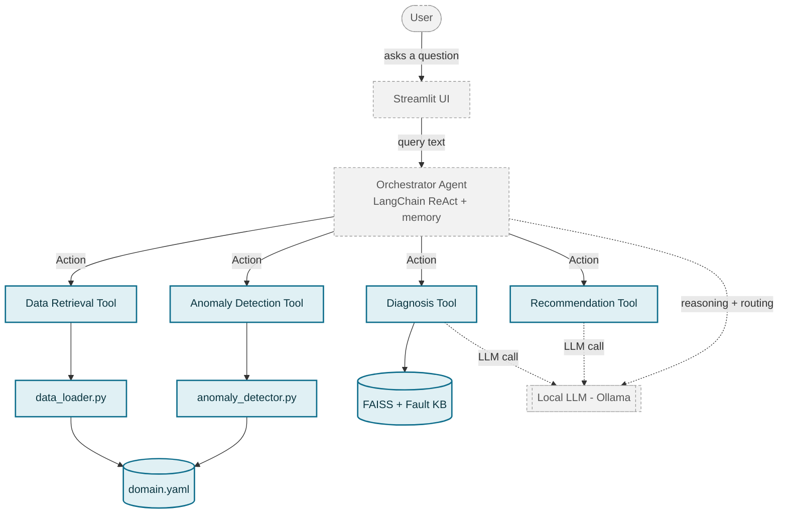

# Turbofan Ops Agent

A multi-agent AI assistant for operational decision support on turbofan
engine sensor data (NASA CMAPSS). An orchestrator routes user questions to
four LangChain tools — data retrieval, anomaly detection, diagnosis (RAG),
and recommendation — built on top of a tested, from-scratch data pipeline
and Isolation Forest anomaly scorer.

Runs entirely on free, local models (Ollama) — no paid API keys required.

## Architecture



Solid arrows are plain function calls (the same calls the test suite
verifies). Dashed arrows are the *only* places the LLM is actually invoked
— notice Data Retrieval and Anomaly Detection never touch it. Shaded/solid
boxes are built and tested; dashed/outlined boxes are Phase 3-4, not yet
built. The full reasoning behind every non-obvious choice below is in
[`docs/DECISIONS.md`](docs/DECISIONS.md).

## Status

| Phase | What | Status |
|---|---|---|
| 1 | Data pipeline (`data_loader.py`) + Isolation Forest anomaly scorer (`anomaly_detector.py`) | ✅ Done, tested |
| 2 | Four LangChain tools (retrieval, anomaly detection, diagnosis w/ RAG, recommendation) | ✅ Done, tested |
| 3 | Orchestrator agent (`create_agent`, native tool calling, threaded memory) routing between the four tools | ✅ Done, validated (`evals/orchestrator_evals.py`) |
| 4 | Streamlit UI (chat + sensor charts) | ⏳ Not started |

## Dataset

NASA's C-MAPSS Turbofan Engine Degradation Simulation dataset (Saxena,
Goebel, Simon & Eklund, *"Damage Propagation Modeling for Aircraft Engine
Run-to-Failure Simulation"*, PHM08). This project uses the **FD001**
subset specifically: 100 training + 100 test engines, one operating
condition, one fault mode (HPC degradation) — the simplest of the four
CMAPSS subsets, chosen deliberately to prove the pipeline before adding
FD002-004's extra operating regimes and second fault mode.

Not redistributed in this repo (see `.gitignore`) — place the standard
CMAPSS FD001 files (`train_FD001.txt`, `test_FD001.txt`, `RUL_FD001.txt`,
`readme.txt`) under `data/raw/`. Search "NASA C-MAPSS Turbofan Engine
Degradation Simulation Dataset" (NASA Prognostics Center of Excellence
Data Repository, also mirrored on Kaggle) to find it.

## Domain config — what makes this extensible

`config/domain.yaml` is the single source of truth for the domain
vocabulary: which column is the asset ID, which are sensors vs.
operational settings, which columns are excluded and *why*
(`exclude_reason` per column, derived from measured variance — not
assumption), human-readable sensor names/units, and the fault knowledge
base the Diagnosis tool retrieves from. Every module (`data_loader.py`,
`anomaly_detector.py`, all four tools) reads this file rather than
hard-coding column names. Pointing it at a different asset/sensor set —
a different CMAPSS subset, or a different machine entirely — is a config
change, not a rewrite.

## Tech stack

| Component | Choice | Why (see `docs/DECISIONS.md` for full reasoning) |
|---|---|---|
| Data handling | pandas, NumPy | — |
| Anomaly detection | scikit-learn `IsolationForest` | Unsupervised — no per-row fault labels exist in the data |
| Agent framework | LangChain `create_agent` (built on LangGraph) | Native tool calling + threaded conversation memory via a checkpointer - not the older `AgentExecutor`/`initialize_agent` APIs, which are deprecated |
| Chat LLM | Ollama, `llama3.1:8b` (no extended "thinking" mode) | Upgraded from `llama3.2` after it failed multi-hop tool chaining 3/3 in testing - see `docs/DECISIONS.md` |
| Embeddings | Ollama, `qwen3-embedding:0.6b` | Right-sized for a ~3-document knowledge base |
| Vector store | FAISS (`langchain-community`) | Semantic retrieval for the Diagnosis tool's RAG step |
| Conversation memory | LangGraph `InMemorySaver`, keyed by `thread_id` | In-process, per-session - a real deployment would need a persistent checkpointer instead |
| Frontend (Phase 4) | Streamlit | Not yet built |
| Testing | pytest, with `monkeypatch`-based LLM mocking | Fast default suite; real end-to-end LLM tests marked `slow` |

## Setup

```bash
python3.11 -m venv venv
source venv/bin/activate
pip install -r requirements.txt

# Pull the local models this project uses
ollama pull llama3.1:8b
ollama pull qwen3-embedding:0.6b

# Place the CMAPSS FD001 files under data/raw/ (see Dataset, above)
```

## Testing

```bash
pytest            # fast suite: 50 tests, ~5s, no LLM calls
pytest -m slow    # 2 real end-to-end tests that call the actual LLM, ~1-2 min
```

52 tests total across the Phase 1 modules and all four Phase 2 tools.
LLM calls are mocked in the default suite (`FakeChatModel` /
`RaisingChatModel` in `tests/conftest.py`) so it runs in seconds and needs
no running Ollama server — the 2 tests that do call the real model are
opt-in via the `slow` marker (`pytest.ini`).

Phase 3's orchestrator has a separate, deliberately non-pytest **eval
harness** instead (`evals/orchestrator_evals.py`) — a real local model
making autonomous tool-routing decisions isn't a deterministic
pass/fail question the way the rest of this suite is. See
`docs/DECISIONS.md` for why that distinction matters and what it found.

## Latency, cost & scaling

Measured directly on this machine (Apple M1, 16GB RAM, no dedicated GPU) —
not textbook numbers:

| Call | Measured time |
|---|---|
| Single chat call, `llama3.2` (no thinking mode) | 27.1 s |
| Single chat call, `qwen3:latest` (thinking mode enabled) | 2 min 3.96 s |
| Full `recommend()` chain (2 sequential LLM calls) | 64.0 s |

Running fully locally means $0 marginal cost per query, but the ReAct
orchestrator (Phase 3) makes *multiple sequential* LLM calls per user
question — they can't run in parallel, since each depends on the previous
step's output. A single question touching all four tools could chain
6-7 calls, meaning **minutes**, not seconds, per response on this
hardware — worth knowing going in, not discovering after Phase 3 is built.
Cost scales the same way, for the same reason (N calls per question, not
one) — latency and cost share one root cause here.

This also means the current design would not sustain many concurrent
users as-is: module-level caches are per-process, Ollama serves one
request at a time with no batching, and conversation memory would need to
move to an external store rather than in-process state. None of that is
implemented here — a laptop demo doesn't need it — but the specific
bottlenecks and their production fixes are documented in
`docs/DECISIONS.md` rather than left unstated.

## Repo structure

```
config/domain.yaml        # domain vocabulary, sensor exclusions, fault knowledge base
data/raw/                 # CMAPSS files (not committed - see Dataset)
docs/
  DECISIONS.md            # engineering decisions log, with reasoning
evals/
  orchestrator_evals.py   # Phase 3 routing eval harness (not pytest - see Testing, below)
  results/                # timestamped CSV output per eval run
src/
  data_loader.py           # ingest, clean, normalize (Phase 1)
  anomaly_detector.py       # Isolation Forest scoring (Phase 1)
  orchestrator.py           # Phase 3: create_agent, system prompt, memory, interactive demo
  tools/
    data_retrieval_tool.py     # sensor summary stats
    anomaly_detection_tool.py  # anomaly scoring, tool-facing
    diagnosis_tool.py          # RAG root-cause diagnosis
    recommendation_tool.py     # corrective action recommendations
tests/                    # 52 tests (50 fast, 2 slow/real-LLM)
requirements.txt
pytest.ini
```
